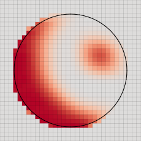

.. _s:embed:

Embedded boundaries
===================

The method of embedded boundaries allows
one to solve equations in complex geometries on a Cartesian mesh.
The surface of a solid body is represented by *cut cells*.
A cut cell is obtained by cutting a regular cubic cell with a plane.
Discretization of the equations with the finite volume method
remains the same, except that the discrete conservation law now includes
additional boundaries in cut cells.

The functionality related to embedded boundaries is provided in header
``embed.h``.

.. code-block:: cpp

  #include <aphros/solver/embed.h>

A new type ``FieldEmbed`` transparently combines ``FieldFace`` and
``FieldCell``.
The cell-field stores the values on embedded boundaries.
Given a mesh ``m``,
a combined field is initialized on the mesh similar to other fields
with an optional default value:

.. code-block:: cpp

  FieldEmbed<Scal> fe(m, 0); // [f]ield [e]mbed

The field can be accessed both by cell- and face-indices.
The following code traverses all internal cells and faces and assigns a
value to the field:

.. code-block:: cpp

  for (IdxCell c : m.Cells()) {
    fe[c] = 1;
  }
  for (IdxFace f : m.Faces()) {
    fe[f] = 1;
  }

A new class ``Embed<M>`` defines
new iterators and geometric routines that take into account cut cells.
The cells and faces are divided into three groups:

* regular cells (whole cells inside the domain),
* cut cells (cells crossed by the domain boundary),
* excluded cells (cells outside the domain).

The same classification applies to faces

* regular faces (whole faces inside the domain),
* cut faces (faces crossed by the domain boundary),
* excluded faces (cells outside the domain).

An instance of ``Embed<M>``, commonly named as ``eb``, is constructed from a
mesh and needs to be initialized from a level-set function :math:`\varphi`
stored in a node-field:

.. code-block:: cpp

  void F(const FieldNode<Scal>& phi) {
    auto sem = m.GetSem();
    struct {
      std::unique_ptr<Embed<M>> eb_;
    } * ctx(sem);
    if (sem()) {
      eb_.reset(new Embed<M>(m));
    }
    if (sem.Nested()) {
      eb_->Init(phi);
    }
  }

Regular cells are those for which :math:`\varphi>0` in all adjacent nodes,
excluded cells are those for which :math:`\varphi<0` in all adjacent nodes,
and other cells are cut cells.
The ``Embed<M>`` class defines ranges ``eb.Cells()`` and ``eb.Faces()``
such that they include regular and cut cells but not excluded cells.
Another range ``eb.CFaces()`` traverses only cut cells.
The name ``CFaces`` comes from *Cell Faces*.
Together, ``eb.Faces()`` and ``eb.CFaces()`` include all indices
for which an embed-field can be defined.
The following code assigns a value to the embed-field
in cut cells, regular faces and cut faces:

.. code-block:: cpp

  for (IdxCell c : eb.CFaces()) {
    fe[c] = 1;
  }
  for (IdxFace f : eb.Faces()) {
    fe[f] = 1;
  }

Class ``Embed<M>`` also defines geometric routines
such as ``eb.GetVolume()`` and ``eb.GetArea()``.
The following code computes the total volume of the domain
and the total area of all boundaries:

.. code-block:: cpp

  Scal vol = 0;
  for (IdxCell c : eb.Cells()) {
    vol += eb.GetVolume(c);
  }
  Scal area = 0;
  for (IdxFace f : eb.Faces()) {
    area += eb.GetArea(f);
  }
  for (IdxCell c : eb.CFaces()) {
    area += eb.GetArea(c);
  }

The range of neighbor indices ``eb.Nci()`` is limited to non-excluded neighbor
faces.  The name ``Nci`` stands for *Neighbor Cell Index*.
The following code sums up the values over all faces of one cut cell ``c``:

.. code-block:: cpp

  IdxCell c;
  Scal sum = fe[c];
  for (size_t q : eb.Nci()) {
    IdxFace f = eb.GetFace(c, q);
    sum += fe[f];
  }

The header defines numerical routines for interpolation
and computation of gradients. Some of them require boundary conditions.

.. code-block:: cpp

  MapEmbedCond mec; // boundary conditions
  FieldEmbed<Scal> feu(m);
  FieldCell<Scal> fcu(m);
  FieldCell<Scal> fci = eb.Interpolate(feu);
  FieldEmbed<Scal> fei = eb.Interpolate(fcu, mec);
  FieldCell<Vect> fcg = eb.Gradient(feu);
  FieldEmbed<Scal> feg = eb.Gradient(fcu, mec);

These routines are sufficient to implement an advection solver

.. includecode:: examples/103_embed_advection/main.cpp
  :func: Advection0
  :comment:
  :impl:

.. |ex103_0_0| image:: ../../../examples/103_embed_advection/example0/u_0000.svg

.. table:: Results of advection solver ``Advection0()``: 
   initial (left) and final (right). Instabilities develop near the boundary.
   :align: center

   +-------------+-------------+
   | |ex103_0_0| | |ex103_0_1| |
   +-------------+-------------+

See full example in :linkpath:`examples/103_embed_advection/main.cpp`.

The previous implementation suffers from the problem of small cells.
Stability requires that the change of the conserved quantity at one time
step does not exceed the cell volume.
Therefore, small cells lead to strong restrictions on the time step.
One common remedy is redistribution of the conserved quantity
to neighboring cells.
Function ``eb.RedistributeCutCells()`` redistributes a conserved quantity
from cut cells to their neighboring cells such that the integral of the
quantity does not change.
Using this function in the advection solver results in

.. includecode:: examples/103_embed_advection/main.cpp
  :func: Advection1
  :comment:
  :impl:

.. |ex103_1_0| image:: ../../../examples/103_embed_advection/example1/u_0000.svg

.. table:: Results of advection solver ``Advection1()``:
   initial (left) and final (right).
   Resdistribution from cut cells stabilized the method.
   :align: center

   +-------------+-------------+
   | |ex103_1_0| | |ex103_1_1| |
   +-------------+-------------+

The fraction of redistributed quantities ``eb.RedistributeCutCells()`` does not
depend on the velocity or the time step.  While this makes a stable method,
the unnecessary redistribution of values may reduce the accuracy.
Another approach is to use a local stability criterion
depending on the velocity

.. math::

   \frac{v_f \Delta t}{S_f |\mathbf{x}_c - \mathbf{x}_f|} < \texttt{CFL}_0
