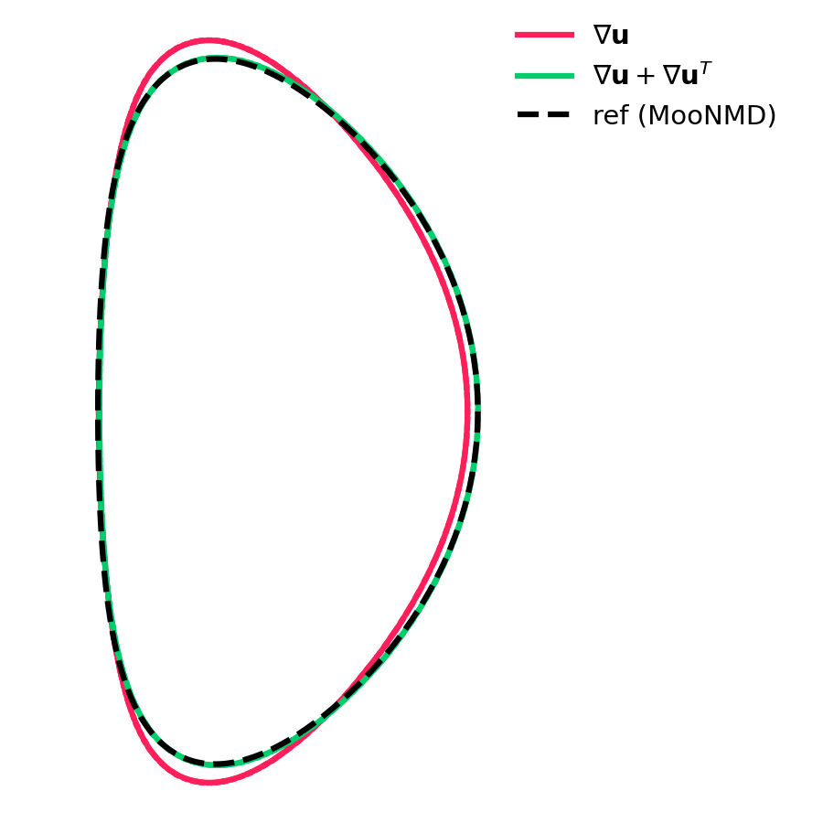

Surface tension as gradient
---------------------------

2018-08-30 22:08:47

**Goal**: zero integral of force

**What**: surface tension as :math:`\nabla (\kappa \alpha)` on faces,
curvature in cells copied from neighbour faces if nan.

**Result**: instability for test of single drop equilibrium,

**Data**: :linkpath:`log01_grad_ka`

-  :linkpath:`log01_grad_ka/grad_ka.mp4`: surface tension as
   :math:`\nabla (\kappa * \alpha)`
-  :linkpath:`log01_grad_ka/k_grad_a.mp4`: surface tension as
   :math:`\kappa \nabla \alpha`
-  :linkpath:`log01_grad_ka/k_grad_a_kmean.mp4`: mean
   curvature on face if both cells contain interface

Particle normal displacement
----------------------------

2018-09-02 09:41:49

**Goal**: reduce spurious flow and deformation for single drop
equilibrium

**What**: particle strings without normal displacement, position of
central particle fixed at the interface line center

**Result**: deformation of the interface greatly reduced, probably due
to stronger coupling or penalization of deformed interfaces

**Data**: :linkpath:`log02_dn`

-  :linkpath:`log02_dn/dn0.mp4`: without normal displacement
-  :linkpath:`log02_dn/dn1.mp4`: with normal displacement

``march=native``
----------------

2018-09-09 11:59:47

**Goal**: use automatic vectorization and specific optimizations

**What**: add ``-march=native`` to ``CMAKE_C_FLAGS`` and
``CMAKE_CXX_FLAGS``

**Result**: slight improvement of performance (3.60 vs 3.76 s for
``confdiff:01:assemble``) with 64 cores on Euler

**Data**: :linkpath:`log03_native`:

-  ``out_std``: standard flags
-  ``out_native``: ``-march=native``

``max_iter``
------------

2018-09-12 14:03:27

**Goal**: choose optimal number of iterations ``max_iter``

**What**: Taylor-Green with bubbles (``sim06``) with
``max_iter``\ =1,2,3,4,5 and ``convsc``\ =\ ``cd``,\ ``quick``.

**Result**

-  qualitatively different trajectories for ``max_iter``\ =1,2;
-  convergence at ``max_iter``\ =4
-  no major difference between ``cd`` and ``quick``,
-  no difference between ``simpler``\ =0 and 1

**Data**: :linkpath:`log04_maxit`

-  ``kedr.pdf``: kinetic energy dissipation rate
-  ``traj.pdf``: x-component of trajectory of bubble 2

Number of particles and strings
-------------------------------

**Goal**: check the influence of the ``part_np`` and ``part_ns`` in
curvature estimator

**What**: Free-field coalescence of bubbles based on ``sim04_univel``

**Result**

-  slight differences in shapes comparing ``np=5,0`` and ``ns=2,3``

**Data**: :linkpath:`log05_coalnp`

-  ``gen1_ns3_np5``: configuration
-  ``nx064_ns?_np?.png``: shapes at ``t=0.466`` with ``nx=64``
-  ``nx128_ns2_np9.png``: shapes at ``t=0.466`` with ``nx=128``

Number of iterations for coalescence
------------------------------------

**Goal**: check the influence of the ``min_iter`` and ``tol`` on bubble
coalescence

**What**: Free-field coalescence of bubbles based on
``sim04_univel/case/partstrcoal``

**Result**

-  negligible difference in trajectories between default and
   ``min_iter=10``

**Data**: :linkpath:`log06_coaliter`

-  ``nx*iter*``: configuration, data, movie
-  ``a.gnu``: gnuplot script

Relaxation parameters
---------------------

2019-03-21 22:48:56

**Goal**: check the influence of ``vrelax`` and ``prelax`` on bubble
coalescence

**What**: Near-wall coalescence of bubbles with
``vrelax=0.8,prelax=0.8`` and ``vrelax=0.9,prelax=1``

**Result**

-  spurious oscillations in the pressure field (``wforce``) with
   ``vrelax=0.9`` after the bubble detachment
-  no effect on x- and y-trajectories, slower rising in z after
   detachment
-  changed default parameters for ``sim04`` to ``prelax=0.8``,
   ``vrelax=0.8`` and ``min_iter=4``

**Data**: :linkpath:`log07_vrelax`

-  ``gen1``: generator of parameters for ``sim04/gen``
-  ``wforce``: force acting on ``z=0`` and ``z=1``
-  ``out``, ``stat.dat``: log and statistics

Reduced usage of ``GetCenter``
------------------------------

2019-04-27 01:19:03

**Goal**: Performance improvement.

**What**: Reduced usage of ``GetCenter`` and ``GetVectToCell``. Test of
the Taylor-Green vortex with bubbles.

**Result**: Speedup of 15%.

**Data** :linkpath:`log08_getcenter`

-  ``tg``: setup
-  ``tg0_*``: timings before
-  ``tg1_*``: timings after

Debug linear solver with ``ConvertLsCompact``
---------------------------------------------

2019-08-15 10:04:39

**Goal**: Fix ``sim12_ringgauss`` after reimplementing ``simple.ipp``
with ``ConvertLsCompact`` in ``48fa3cf0``. Iterations for pressure
correction diverged.

**What**: Bisection between ``1ffd55c5`` from ``Jan 12 2019`` and
``9cb90989`` from ``Aug 14 2019``. Complication from another bug in
``InitVort()`` which attempted to use uninitialized ``fs_`` in
``hydro.h`` (fixed by ``patch``).

**Result**: Found the problem by printing the coefficients of the linear
system before and after ``ConvertLs()`` or ``ConvertLsCompact()``. The
problem appeared from changing the order of stencil cells. In ``sim12``,
the symmetric linear solver is called twice: for initialization of
vorticity and for pressure correction. Then Hypre is apparently
initialized only once and that instance is used for both cases which
leads to the wrong order of coefficients.

**Data**: :linkpath:`log09_debug_linear`

-  ``patch``: fix for ``InitVort()``
-  ``r``: tool to apply patch and rebuild
-  ``simple_{bad,good}.ipp``: two versions of ``simple.ipp``
-  ``min``: minimal simulation setup

Registered modules in Ubuntu
----------------------------

2020-06-03 11:34:54

Ubuntu has ``--as-needed`` by default (seen from ``gcc -dumpspecs``)
which makes the linker ignore unused libraries
and, in particular, the implementations of modules (e.g. ``init_contang.so``).

VTK merge, comparison of floats with tolerance
----------------------------------------------

2020-06-13 21:56:35

``ConvertMerge`` in ``dump/vtk.h`` mapped each ``Vect`` to a hash
and used the hash to merge closely located points together
(up to tolerance ``tol``).
This effectively split the space of ``Vect`` to partitions.
However, if two points are located close to the boundary between
two partitions, they can be arbitrarily close but have
different hash values.

The solution was to check compare against the hash
of neighboring points (from vertices of a cube)
when looking for an existing hash.

Minimal example that gave vertices of rank 1: :linkpath:`log10_vtkmerge`.

The opposite problem: hash collisions of distant points.
Example is in ``log10_vtkmerge/hash_collision``.
To fix, changed the map from ``hash->index`` to ``Vect->index``
(ensures exact comparison of points)
and introduced ``canonical(x)`` to get a single point from the cell of
size ``tol``.

.. image:: log10_vtkmerge/vtkmerge.*
  :align: center
  :width: 300

Explicit part of viscous stress
-------------------------------

2021-06-11 15:32:27

The viscous stress tensor has the form :math:`\mu(\nabla\mathbf{u} +\nabla\mathbf{u}^T)`.
Parameter ``int explviscous`` controls whether the second term is included in
the discretization. Setting ``explviscous=0`` changes the approximated tensor
to :math:`\mu\nabla\mathbf{u}`.
This omitted term :math:`\mu\nabla\mathbf{u}^T` is significant if the dynamic viscosity is non-uniform.

The following test case of a rising bubble
(based on `<http://basilisk.fr/src/test/rising.c>`_) shows a small difference.
See full example in :linkpath:`examples/208_rising`.

.. table:: Bubble shapes at :math:`t=3`
  :align: center
  :name: t:bubble

  +----------+
  | |log11|  |
  +----------+
