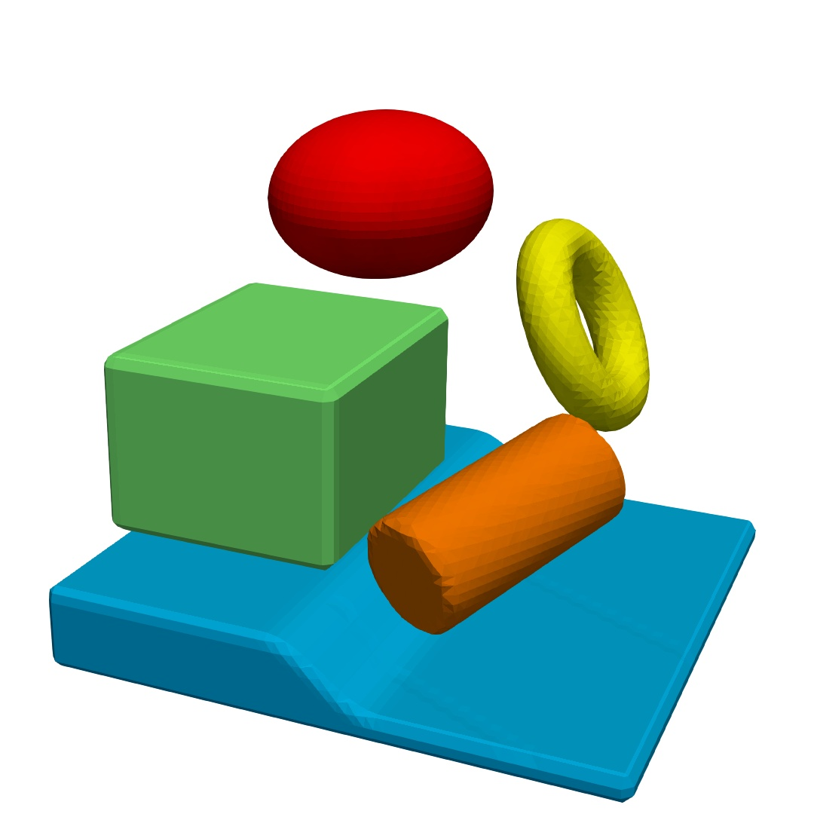

.. _s:primlist:

Geometric primitives
====================

Header ``func/primlist.h`` provides routines to define level-set functions
for a list of geometric primitives such as spheres and boxes.
A primitive is described by

.. includecode:: src/func/primlist.h
  :struct: Primitive

Function ``Parse()`` parses a stream with a list of primitives.

.. includecode:: src/func/primlist.h
  :func: Parse
  :comment:

Available primitives and their parameters:

* ``sphere``: ``cx cy cz`` (center), ``rx ry rz`` (half-size)
* ``box``: ``cx cy cz`` (center), ``rx ry rz`` (half-size)
* ``ring``: ``cx cy cz`` (center), ``nx ny nz`` (normal),
  ``r`` (radius), ``th`` (thickness)
* ``smooth_step``: ``cx cy cz`` (center), ``nx ny nz`` (normal),
  ``tx ty tz`` (tangent), ``ln`` (size along normal), ``lt`` (size along tangent)
* ``cylinder``: ``cx cy cz`` (center), ``tx ty tz`` (axis), ``r`` (radius),
  ``t0 t1`` (coordinates relative to center)

Example of a list of primitives

.. includecode:: examples/200_primlist/b.dat
  :language: none

Characters ``&`` and ``-`` are modifiers:

* ``&``: intersection, take minimum with level-set from all entries above.
* ``-``: minus, multiply level-set by -1,

(see setup in :linkpath:`examples/200_primlist`)

