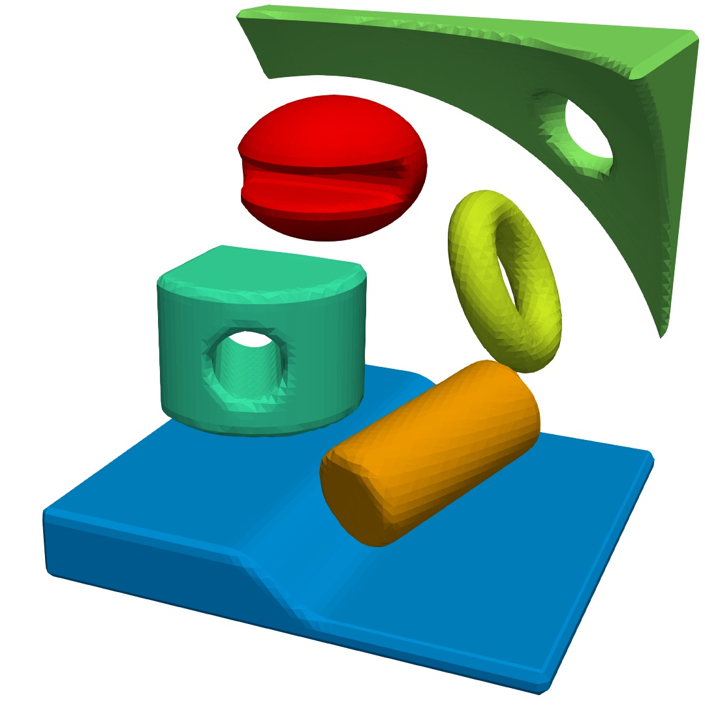

.. _s:primlist:

Geometric primitives
====================

Header ``func/primlist.h`` provides routines to define level-set functions
for a list of geometric primitives such as spheres and boxes.
A primitive is described by

.. includecode:: src/func/primlist.h
  :struct: Primitive

Function ``Parse()`` parses a stream with a list of primitives.

.. includecode:: src/func/primlist.h
  :func: Parse
  :comment:

Example of a list of primitives

.. includecode:: examples/200_primlist/b.dat
  :language: none

(see setup in :linkpath:`examples/200_primlist`)

